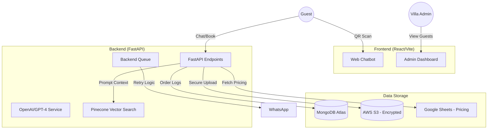

# EASY-BALI Architecture & Environment

## 🏗 System Architecture

---

## 🔑 Environment Variables Configuration

### Backend (`.env`)

| Variable | Description | Example |
| :--- | :--- | :--- |
| `MONGO_URII` | Connection string for MongoDB | `mongodb+srv://...` |
| `OPENAI_API_KEY` | GPT-4 Access | `sk-proj...` |
| `AWS_ACCESS_KEY` | S3 Upload Access | `AKIA...` |
| `AWS_SECRET_KEY` | S3 Upload Secret | `...` |
| `AWS_BUCKET_NAME` | S3 Bucket name | `easybali-docs` |
| `XENDIT_SECRET_KEY` | Payment Gateway key | `xnd_production_...` |
| `PINECONE_API_KEY` | Search API Key | `...` |

### Frontend (`.env`)

| Variable | Description | Example |
| :--- | :--- | :--- |
| `VITE_API_URL` | Endpoint for backend | `https://api.easybali.com` |
| `VITE_WA_PHONE_NUMBER` | Official Contact | `628123456789` |

---

## 🛠 Developer Onboarding Guide

### 1. Local Environment Setup

1. **Clone**: `git clone <repository-url>`
2. **Environment**: Create `.env` files in both `easybali-backend` and `bali-frontend`.
3. **Dependencies**:
    - Backend: `pip install -r requirements.txt`
    - Frontend: `npm install`

### 2. Seeding Data

- Run `python ingest_faqs.py` to populate the Pinecone vector index from Google Sheets.
- Run `python app/db/ensure_indexes.py` to prepare MongoDB collections.

### 3. Testing Flow

- Use **Postman** to test the `/passports/upload` endpoint with a multipart form request.
- Use the **Categories** tab in the chatbot to verify pricing logic is fetching correctly from Sheets.
